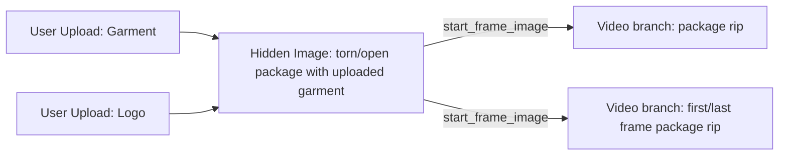

# Amazon Delivery Logo Feedback Audit - 2026-05-22

## Trigger

Admin feedback was submitted for job `c29ec5f0-3d06-48bb-a0fd-cf07004688ce`:

> the second video im seeing here doesnt append the logo to the bag like the first one does .

Template version: `51c3b6c5-9b57-4d50-9b22-7be82c783427`

## Root Cause

The upstream image branch for the package had the uploaded logo in its input payload, but two downstream video prompts described the bag/rip action without explicitly preserving the logo already printed on the bag.

For image-to-video, that is enough room for the model to drift and remove or blur the logo as the bag moves.

## Fixed Path

## Production Changes Applied

Migration: `20260522213000_fix_amazon_delivery_logo_video_prompts.sql`

Changed graph data:

- Updated video node `cf730b82-4211-4639-b7ba-b9d11d0bf2d5` to preserve the uploaded logo already printed on the bag from first frame through final frame.
- Updated video node `13c9da7a-1f00-4d96-b736-2c6406b8321c` with the same logo preservation lock.

## Remaining Validation

The next production Amazon/Delivery Guy run should be visually checked to confirm the package logo remains visible during the second video branch.
