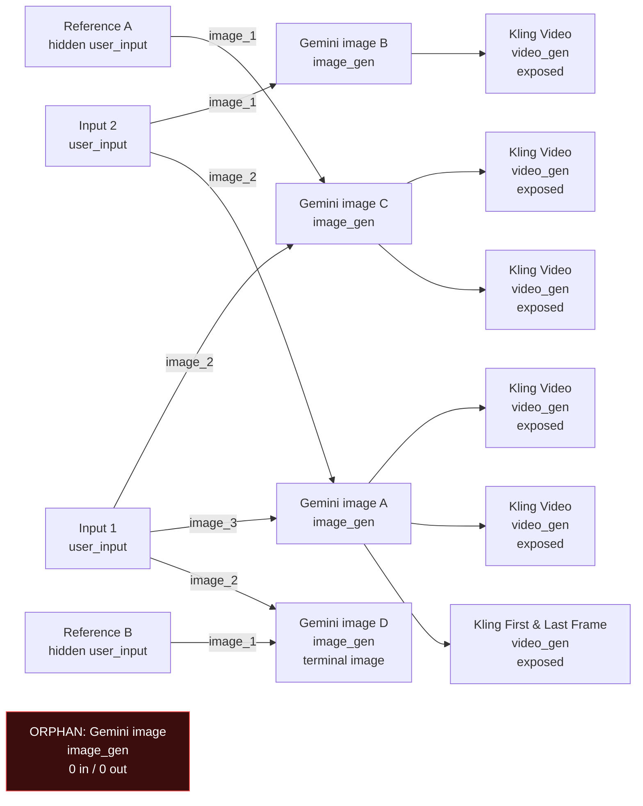
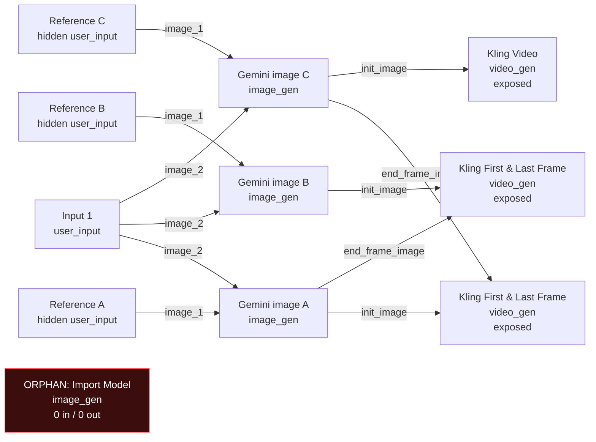
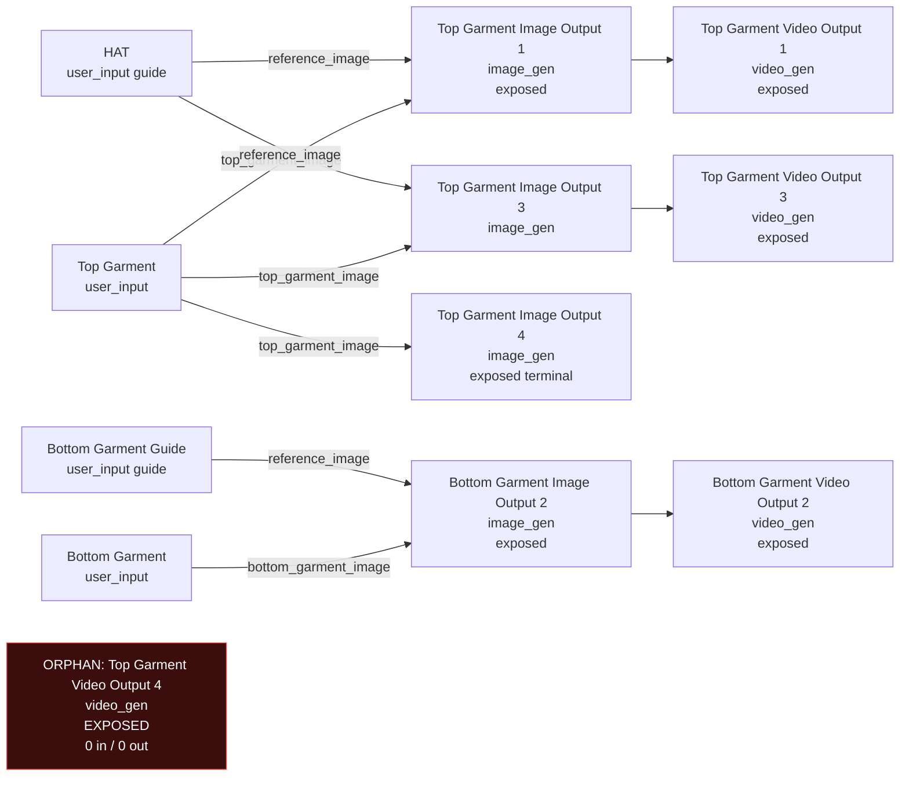

# Production Graph Audit - 2026-05-22

Scope: active live `template_versions` in production Supabase.

## Active Version Summary

| Template | Live version | User inputs | Execution nodes | Orphan execution nodes | Exposed outputs |
|---|---:|---:|---:|---:|---:|
| AMAZON GUY | v2 | 4 | 11 | 1 | 6 |
| RAVEN | v2 | 4 | 7 | 1 | 3 |
| UGC Mirror Grunge | v1 | 4 | 8 | 1 | 7 |
| ARMORED TRUCK | v2 | 5 | 26 | 0 | 10 |
| BLUE LAB | v2 | 9 | 12 | 0 | 6 |
| GARAGE | v2 | 4 | 22 | 0 | 6 |
| GAS STATION | v2 | 5 | 26 | 0 | 11 |
| GRILLZZZZ | v2 | 12 | 14 | 0 | 14 |
| ICE PICK | v2 | 10 | 17 | 0 | 8 |
| JEANS | v2 | 2 | 19 | 0 | 7 |
| PAPARAZZI | v3 | 2 | 2 | 0 | 1 |
| SKATEPARK | v2 | 9 | 14 | 0 | 6 |
| UGC MIRROR | v2 | 3 | 5 | 0 | 3 |
| UNBOXING | v2 | 4 | 18 | 0 | 6 |

## Version Status

| Template | Live version | Other versions |
|---|---:|---|
| AMAZON GUY | v2 | v1 inactive |
| RAVEN | v2 | v1 inactive |
| UGC Mirror Grunge | v1 | none |

## Legend

- `user_input`: customer upload or hidden guide/reference image node.
- `image_gen`: image generation step.
- `video_gen`: video generation step.
- `orphan`: an image/video step with no incoming edge. It cannot receive an image from an upload, guide, or prior output.
- `exposed`: marked as final deliverable output.

## AMAZON GUY v2

## RAVEN v2

## UGC Mirror Grunge v1

