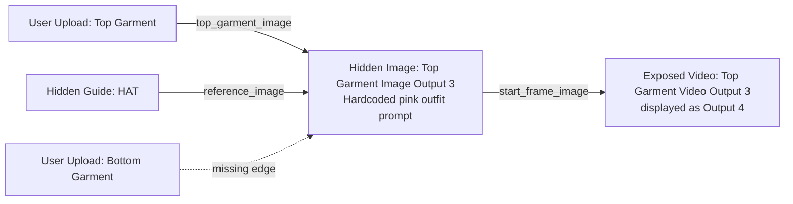
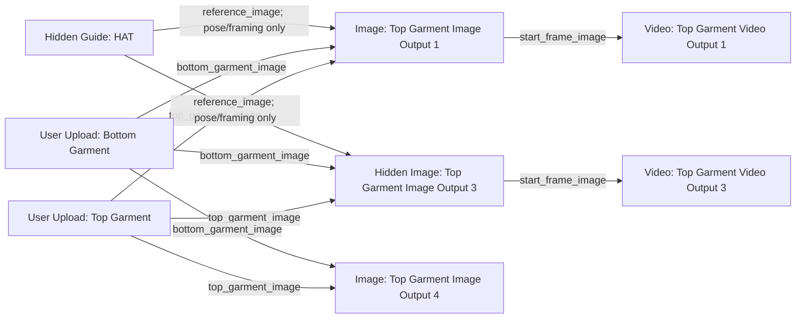

# UGC Mirror Grunge Path Audit - 2026-05-22

## Trigger

Admin feedback was submitted for job `aaeceb23-7e92-4e2b-b461-cf0fdd7a36a2`:

> OUTPUT 4 IS USING NON RELATED CLOTHING. INSPECT THE ENTIREITY OF THIS PATHWAY TO SEE WHY ITS NOT TAKING ON ANY OF THE INPUT CLOTHES?

Template version: `cee82b94-abf1-49a1-a336-88c9025528bb`

## Root Cause

Output 4 was not a FAL balance issue or a global runner issue. The live graph data for this UGC Mirror Grunge version had two graph problems:

1. The hidden top-garment image branch had hardcoded prompt text for a pastel pink zip-up hoodie, leggings, and headband.
2. The bottom garment upload was not connected into the top/full outfit image branches, so those branches could invent or copy bottoms from a guide instead of using the uploaded bottom garment.

That means the model was literally being asked to produce unrelated clothing on one branch.

## Bad Path Before Fix

## Fixed Path

## Production Changes Applied

Migration: `20260522211500_fix_ugc_mirror_grunge_prompt_wiring.sql`

Changed graph data:

- Added bottom garment input edges into:
  - `Top Garment Image Output 1`
  - `Top Garment Image Output 3`
  - `Top Garment Image Output 4`
- Replaced the hardcoded pink outfit prompts with prompts that preserve uploaded top and bottom garments exactly.
- Updated downstream video prompts to preserve the start frame clothing exactly.
- Hid orphan `Top Garment Video Output 4`, which had no incoming or outgoing edges and should not be exposed.

## Verification Query Result

After the migration, production shows:

- `Top Garment Image Output 1`: `incoming = 3`
- `Top Garment Image Output 3`: `incoming = 3`
- `Top Garment Image Output 4`: `incoming = 2`
- Bottom garment now feeds all three target image branches as `bottom_garment_image`.
- The orphan `Top Garment Video Output 4` is `output_exposed = false`.

## Remaining Validation

The next production run of UGC Mirror Grunge should be checked visually. The expected result is that Output 4 no longer creates the pink outfit and instead uses the uploaded top/bottom garment pair.
